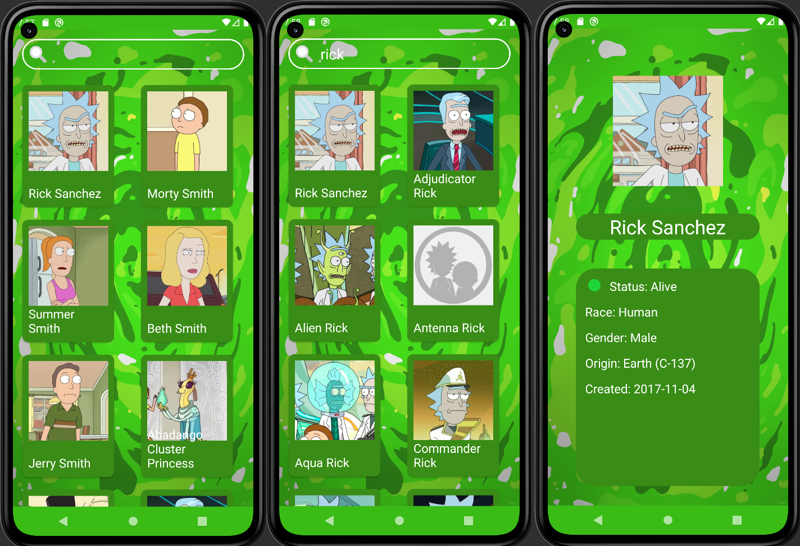

<p align = "center">МИНИСТЕРСТВО НАУКИ И ВЫСШЕГО ОБРАЗОВАНИЯ
РОССИЙСКОЙ ФЕДЕРАЦИИ
ФЕДЕРАЛЬНОЕ ГОСУДАРСТВЕННОЕ БЮДЖЕТНОЕ
ОБРАЗОВАТЕЛЬНОЕ УЧРЕЖДЕНИЕ ВЫСШЕГО ОБРАЗОВАНИЯ
«САХАЛИНСКИЙ ГОСУДАРСТВЕННЫЙ УНИВЕРСИТЕТ»</p>
<br><br><br><br><br><br>
<p align = "center">Институт естественных наук и техносферной безопасности<br>Кафедра информатики<br>Чагочкин Никита</p>
<br><br><br>
<p align = "center">Лабораторная работа №12<br>«Каталог персонажей».<br>01.03.02 Прикладная математика и информатика</p>
<br><br><br><br><br><br><br><br><br><br><br><br>
<p align = "right">Научный руководитель<br>
Соболев Евгений Игоревич</p>
<br><br><br>
<p align = "center">г. Южно-Сахалинск<br>2023 г.</p>

***
# <p align = "center">Каталог персонажей из Рика и Морти</p>
Требуется разработать мобильное приложение на Kotlin для поиска информации о персонажах из вселенной Рика и Морти.Нужные вам данные о персонажах можно взять с помощью api
***
# <p align = "center">Реализация </p>

## <p align = "center">MainActivity.kt</p>
```Kotlin

        class MainActivity : AppCompatActivity(),CharacterAdapter.Listener {

            lateinit var binding: ActivityMainBinding
            private var adapter=CharacterAdapter(this)

            var charactersList: ArrayList<Character> = ArrayList<Character>()


            override fun onCreate(savedInstanceState: Bundle?) {
                super.onCreate(savedInstanceState)

                binding=ActivityMainBinding.inflate(layoutInflater)
                setContentView(binding.root)
                getAllCharacters()

                binding.searchText?.addTextChangedListener(object : TextWatcher {
                    override fun onTextChanged(cs: CharSequence, arg1: Int, arg2: Int, arg3: Int) {
                        var searchedList=ArrayList<com.example.rickmortyxml.Character>()
                        var searchName=binding.searchText.text.toString()
                        if(searchName!=""){
                            for (i in charactersList){
                                if(i.getName().toLowerCase().contains(searchName.toLowerCase())){
                                    searchedList.add(i)
                                }
                            }
                            updateCharacters(searchedList)
                        }

                    }

                    override fun beforeTextChanged(s: CharSequence, arg1: Int, arg2: Int, arg3: Int) {}
                    override fun afterTextChanged(arg0: Editable) {

                    }
                })


            }

            private fun getAllCharacters(){
                var pagescount=0
                val queue= Volley.newRequestQueue(this)
                //Запрос на получение кол-ва страниц
                val stringRequest = StringRequest(Request.Method.GET,
                    "https://rickandmortyapi.com/api/character",
                    {
                            response->
                        val obj = JSONObject(response).getJSONObject("info")
                        pagescount = obj.getInt("pages")
                        Log.d("MyLog","Pages count:${pagescount}")
                        for (i in 1..pagescount){
                            Log.d("MyLog","Цикл# :${i}")
                            getCharactersOnPage(i)

                        }

                        Log.d("MyLog","characters count:${charactersList.size.toString()}")
                    },
                    {
                        Log.d("MyLog","Volley error: $it")
                    }
                )
                queue.add(stringRequest)


            }
            private fun getCharactersOnPage(page:Int){
                val url="https://rickandmortyapi.com/api/character/?page=$page"
                val queue= Volley.newRequestQueue(this)
                val stringRequest = StringRequest(Request.Method.GET,
                    url,
                    {
                            response->
                        val obj = JSONObject(response).getJSONArray("results")
                        for (i in 0..obj.length()-1){
                            val personFromJson=obj.getJSONObject(i)
                            charactersList.add(
                                Character(personFromJson.getInt("id"), personFromJson.getString("name"), personFromJson.getString("image"))
                            )
                            Log.d("MyLog","Кол-во героев:${charactersList.size}")
                            updateCharacters(charactersList)
                        }
                    },
                    {
                        Log.d("MyLog","Volley error: $it")
                    }
                )
                queue.add(stringRequest)
            }

            private fun updateCharacters(data:ArrayList<com.example.rickmortyxml.Character>){
                binding.apply {
                    recycleView.layoutManager=GridLayoutManager(this@MainActivity,2)
                    recycleView.adapter=adapter
                    adapter.updateCharacters(data)
                }
            }

            override fun onClickCharacter(character: Character) {
                val myIntent = Intent(this@MainActivity, PageCharacter::class.java)
                myIntent.putExtra("id", character.getId().toInt())
                startActivity(myIntent)
            }


```
## <p align = "center">CharacterAdapter.kt</p>
```Kotlin

        class CharacterAdapter(val listener:Listener):RecyclerView.Adapter<CharacterAdapter.ViewHolder>() {

            var CharacterList=ArrayList<com.example.rickmortyxml.Character>()
            class ViewHolder(item:View):RecyclerView.ViewHolder(item) {
                val binding=ListItemBinding.bind(item)
                fun bind(character:com.example.rickmortyxml.Character,listener: Listener)= with(binding){
                    name.text=character.getName()
                    image.load(character.getImage())
                    itemView.setOnClickListener {
                        listener.onClickCharacter(character)
                    }
                }
            }

            override fun onCreateViewHolder(parent: ViewGroup, viewType: Int): ViewHolder {
                val view=LayoutInflater.from(parent.context).inflate(R.layout.list_item,parent,false)
                return ViewHolder(view)
            }

            override fun getItemCount(): Int {
                return CharacterList.size
            }

            override fun onBindViewHolder(holder: ViewHolder, position: Int) {
                holder.bind(CharacterList[position],listener)
            }

            public fun updateCharacters(newList:ArrayList<com.example.rickmortyxml.Character>){
                CharacterList=newList
                notifyDataSetChanged()
            }

            interface Listener{
                fun onClickCharacter(character:com.example.rickmortyxml.Character)
            }

```
## <p align = "center">CharacterAdapter.kt</p>
```Kotlin

        data class Character (private val id: Int, private val name: String, private val image: String) {
            fun getId(): Int = id
            fun getName(): String = name
            fun getImage(): String = image
        }
```
## <p align = "center">PageCharacter.kt</p>
```Kotlin

        class PageCharacter() : AppCompatActivity() {

            lateinit var binding: CharacterPageBinding
            var id=1

            override fun onCreate(savedInstanceState: Bundle?) {
                super.onCreate(savedInstanceState)
                binding=CharacterPageBinding.inflate(layoutInflater)
                setContentView(binding.root)
                val mIntent=intent
                id = mIntent.getIntExtra("id",1)
                val url="https://rickandmortyapi.com/api/character/$id"
                val queue= Volley.newRequestQueue(this)
                val stringRequest = StringRequest(
                    Request.Method.GET,
                    url,
                    {
                            response->
                        val obj = JSONObject(response)
                        binding.nameTitle.text=obj.getString("name")
                        binding.status.text="Status: "+obj.getString("status")
                        binding.race.text="Race: "+obj.getString("species")
                        binding.gender.text="Gender: "+obj.getString("gender")
                        binding.origin.text="Origin: "+obj.getJSONObject("origin").getString("name")
                        binding.date.text="Created: "+obj.getString("created").toString().slice(0..9)
                        binding.image.load(obj.getString("image"))
                        if(obj.getString("status")=="Alive"){
                            binding.stround.getBackground()?.setTint(Color.parseColor("#1fd537"))

                        }else if(obj.getString("status")=="Dead") {binding.stround.getBackground()?.setTint(Color.parseColor("#F3000C"))}else binding.stround.getBackground()?.setTint(Color.parseColor("#D8D8D8"))
                    },
                    {
                        Log.d("MyLog","Volley error: $it")
                    }
                )
                queue.add(stringRequest)
            }

```

## <p align = "center">activity_main.xml</p>
```Xml

        <?xml version="1.0" encoding="utf-8"?>
        <RelativeLayout xmlns:android="http://schemas.android.com/apk/res/android"
            xmlns:app="http://schemas.android.com/apk/res-auto"
            xmlns:tools="http://schemas.android.com/tools"
            android:layout_width="match_parent"
            android:layout_height="match_parent"
            tools:context=".MainActivity"
            android:background="@drawable/portal"
            >
            <LinearLayout
                android:id="@+id/searchField"
                android:layout_width="match_parent"
                android:layout_height="50dp"
                android:orientation="horizontal"
                android:background="@drawable/rounded_linear"
                android:layout_margin="15dp">
                <ImageView
                    android:id="@+id/imageViewEmail"
                    android:layout_width="32dp"
                    android:layout_height="32dp"
                    app:srcCompat="@drawable/search"
                    android:layout_margin="10dp"
                    android:layout_gravity="center_vertical"/>
                <EditText
                    android:id="@+id/search_text"
                    android:inputType="text"
                    android:layout_width="match_parent"
                    android:layout_height="match_parent"
                    android:background="@android:color/transparent"
                    android:textSize="24dp"
                    android:textColor="@color/white" />

            </LinearLayout>
            <androidx.recyclerview.widget.RecyclerView
                android:id="@+id/recycleView"
                android:layout_width="match_parent"
                android:layout_height="match_parent"
                android:layout_marginBottom="0dp"
                android:horizontalSpacing="6dp"
                android:numColumns="2"
                android:paddingLeft="5dp"
                android:scrollbars="vertical"
                android:layout_below="@+id/searchField"/>

        </RelativeLayout>
```
## <p align = "center">character_page.xml</p>
```Xml

        <?xml version="1.0" encoding="utf-8"?>
        <LinearLayout xmlns:android="http://schemas.android.com/apk/res/android"
            xmlns:app="http://schemas.android.com/apk/res-auto"
            xmlns:tools="http://schemas.android.com/tools"
            android:layout_width="match_parent"
            android:layout_height="match_parent"
            android:background="@drawable/portal"
            android:orientation="vertical"
            >
            <LinearLayout
                android:layout_width="wrap_content"
                android:layout_height="360dp"
                android:orientation="vertical"
                android:layout_gravity="center_horizontal"
                android:layout_marginTop="32dp">
            <ImageView
                android:id="@+id/image"
                android:layout_width="180dp"
                android:layout_height="270dp"
                android:src="@mipmap/ic_launcher"
                android:layout_gravity="center_horizontal"
                >

            </ImageView>
            <TextView
                android:id="@+id/nameTitle"
                android:layout_width="300dp"
                android:layout_height="wrap_content"
                android:text="Hero Name"
                android:textColor="@color/white"
                android:textSize="32dp"
                android:gravity="center_horizontal"
                android:background="@drawable/rounded_linear"
                android:backgroundTint="#398c16"
                android:textAlignment="center">
            </TextView>
            </LinearLayout>


            <LinearLayout
                android:layout_width="300dp"
                android:layout_height="match_parent"
                android:orientation="vertical"
                android:background="@drawable/rounded_linear"
                android:backgroundTint="#398c16"
                android:layout_gravity="center_horizontal"
                android:layout_marginBottom="32dp">
            <LinearLayout
                android:layout_width="match_parent"
                android:layout_height="wrap_content">
                <TextView
                    android:id="@+id/stround"
                    android:layout_width="20dp"
                    android:layout_height="20dp"
                    android:layout_marginLeft="20dp"
                    android:layout_marginTop="11dp"
                    android:background="@drawable/round"
                    >
                </TextView>
                <TextView
                    android:id="@+id/status"
                    android:layout_width="wrap_content"
                    android:layout_height="wrap_content"
                    android:text="Status"
                    android:textColor="@color/white"
                    android:textSize="20dp"
                    android:layout_margin="15dp"
                    ></TextView>
            </LinearLayout>

                <TextView
                    android:id="@+id/race"
                    android:layout_width="wrap_content"
                    android:layout_height="wrap_content"
                    android:text="Race"
                    android:textColor="@color/white"
                    android:textSize="20dp"
                    android:layout_marginLeft="15dp"
                    ></TextView>
                <TextView
                    android:id="@+id/gender"
                    android:layout_width="wrap_content"
                    android:layout_height="wrap_content"
                    android:text="Male"
                    android:textColor="@color/white"
                    android:textSize="20dp"
                    android:layout_marginTop="15dp"
                    android:layout_marginLeft="15dp"
                    ></TextView>
                <TextView
                    android:id="@+id/origin"
                    android:layout_width="wrap_content"
                    android:layout_height="wrap_content"
                    android:text="Earth"
                    android:textColor="@color/white"
                    android:textSize="20dp"
                    android:layout_marginTop="15dp"
                    android:layout_marginLeft="15dp"
                    ></TextView>
                <TextView
                    android:id="@+id/date"
                    android:layout_width="wrap_content"
                    android:layout_height="wrap_content"
                    android:text="2017-11-04"
                    android:textColor="@color/white"
                    android:textSize="20dp"
                    android:layout_marginTop="15dp"
                    android:layout_marginLeft="15dp"
                    ></TextView>
            </LinearLayout>
        </LinearLayout>
```
## <p align = "center">list_item.xml</p>
```Xml

        <?xml version="1.0" encoding="utf-8"?>
        <androidx.cardview.widget.CardView xmlns:android="http://schemas.android.com/apk/res/android"
            xmlns:app="http://schemas.android.com/apk/res-auto"
            android:layout_width="150dp"
            android:layout_height="200dp"
            android:layout_gravity="center"
            android:layout_margin="10dp"
            app:cardCornerRadius="10dp"
            android:backgroundTint="#398c16">

            <ImageView
                android:id="@+id/image"
                android:layout_width="130dp"
                android:layout_height="130dp"
                android:src="@mipmap/ic_launcher"
                android:layout_margin="10dp">
            </ImageView>
            <TextView
                android:id="@+id/name"
                android:layout_width="wrap_content"
                android:layout_height="wrap_content"
                android:text="Character Name"
                android:textSize="20dp"
                android:textColor="@color/white"
                android:layout_gravity="bottom"
                android:layout_margin="10dp"
                >
            </TextView>
        </androidx.cardview.widget.CardView>
```
## <p align = "center">Вывод</p>
### Во время выполнения данной работы я порактиковался в создании и заполнении RecyclerView, и поработал с API